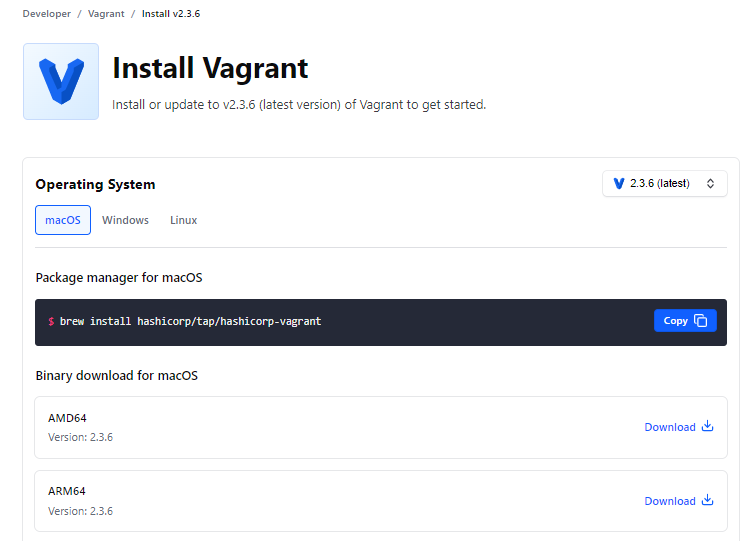

# Workshop 01 - Vagrant
[Code Here](https://github.com/fborge/isw-811/tree/master/Workshop-01)

## **Instalación Virtual Box**

Para la descarga de Virtual Box dirigirse al siguiente link [VirtualBox Download](https://www.virtualbox.org/wiki/Downloads) y escoger la versión
dependiendo del sistema operativo de la máquina, tal como se muestra en la imagen.


En este caso se estará utilizando Windows por tanto posterior a la descarga, basta con ejecutar el archivo .exe y presionar siguiente.

## **Instalación Vagrant**

Para la descarga de Vagrant dirigirse al siguiente link [Vagrant Download](https://developer.hashicorp.com/vagrant/downloads) y escoger la versión dependiendo del sistema operativo de la máquina, tal como se muestra en la imagen.



En este caso se estará utilizando Windows por tanto posterior a la descarga, basta con ejecutar el archivo .exe y presionar siguiente.

Al instalar vagrant en windows no se va a visualizar ningún icono en el escritorio o en el sistema entonces para confirmar que este se

ha instalado se puede ejecutar una terminal y lanzar el siguiente comando:

```
vagrant -v
```
Esto mostrará en la terminal la versión de vagrant instalada como se muestra en la imagen.


## **Aprovisionamiento máquina Bullseye**

Posterior a la instalacion de vagrant se ejecuta en la terminal el siguiente comando para poner en marcha
dentro de virtual box la maquina con la que se trabajará

```
vagrant init debian/bullseye64
```
Al finalizar la instalacion se verá de la siguiente forma.


Posterior a esto y antes de poner en marcha la maquina que se acaba de crear se debe editar el archivo VagrantFile generado y descomentar la linea referente a la direccion de la red e IP a utilizar.


Seguidamente ya se podria poner en marcha la maquina yendo a la terminal y ejecutando los siguientes comandos:

```
vagrant up
```
Para ingresar ejecutamos:

```
vagrant ssh
```

Si todo marcha bien debería verse de la siguiente manera:


