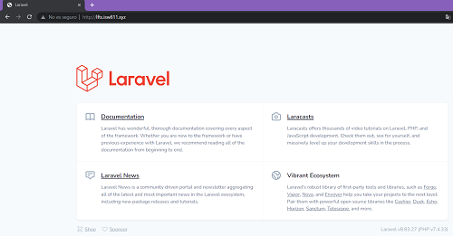

# **Instalación de Laravel en Bullseye**
 [Code Here](https://github.com/fborge/isw-811/tree/master/Workshop-03) 

## **Iniciar máquina virtual**
Para iniciar la máquina virtual nos desplazamos hasta la ubicación del <font color="red">**Vagrantfile**</font>.
y ahí ejecutamos el comando.

```
cd /ISW811/VMs/webserver
vagrant up
```

## **Editar el archivo hosts.**
En los sistemas operativos tipo Windows, el archivo hosts se encuentra enla ruta
c:\Windows\System32\drivers\etc. 

Desde un cmd ejecutado como administrador, se puede editar de la siguiente manera.

```
cd \
cd Windows\System32\drivers\etc
notepad hosts
```
Dentro del archivo vamos a agregar.

```
192.168.33.10 lfts.isw811.xyz.conf
192.168.33.10 lospatitos.com.conf
192.168.33.10 elblogdefran.com.conf
```
## **Crear el conf para cada sitio.**
Necesitaremos crear un archivo <font color="red">**.conf**</font>
para cada sitio que deseemos hospedaren el servidor web. Desde la máquina anfitriona vamos a 

ingresar a la carpeta confs y crear el archivo <font color="red">**.conf**</font> para cada sitio a simular.

```
cd confs
touch lfts.isw811.xyz.conf
touch lospatitos.com.conf
touch elblogdefran.com.conf
```
## **Editar cada conf.**
A continuación se edita el contenido de cada archivo <font color="red">**.conf**</font> para cada dominio que se creo en el paso anterior.

```
    <VirtualHost *:80>
  ServerAdmin webmaster@NOMBREDELDOMINIO
  ServerName NOMBREDELDOMINIO

  # Indexes + Directory Root.
  DirectoryIndex index.php index.html
  DocumentRoot /home/vagrant/sites/NOMBREDELDOMINIO

  <Directory /home/vagrant/sites/NOMBREDELDOMINIO>
    DirectoryIndex index.php index.html
    AllowOverride All
    Require all granted
  </Directory>

  ErrorLog ${APACHE_LOG_DIR}/NOMBREDELDOMINIO.error.log
  LogLevel warn
  CustomLog ${APACHE_LOG_DIR}/NOMBREDELDOMINIO.access.log combined
    </VirtualHost>
```
## **Crear folders para cada sitio**

Ahora crearemos un directorio para cada sitio, junto con el contenido que deseamos mostrar en cada dominio.
```
cd sites
mkdir elblogdefran.com 
mkdir lospatitos.com 
mkdir lfts.isw811.xyz
```
Luego creamos un index para cada sitio
```
cd elblogdefran.com
touch index.html

cd lospatitos.com 
touch index.html

cd lfts.isw811.xyz
touch index.html
```
## **Conectarse por SSH**
Para conectarse a una máquina Vagrant ,nos desplazamos hasta la ubicación del
Vagrantfile y ejecutamos.

```
vagrant ssh
```

## **Copiar los confs**
Desde la máquina virtual copiamos todos los archivos .conf desde el directorio /vagrant/confs
al directorio de sitios disponibles de Apache2 en /etc/apache2/sites-available
, con los siguientes comandos.

sudo cp /vagrant/confs/elblogdefran.com.conf /etc/apache2/sites-available

sudo cp /vagrant/confs/elblogdefran.com.conf /etc/apache2/sites-available

sudo cp /vagrant/confs/elblogdefran.com.conf /etc/apache2/sites-available


## **Habilitamos cada sitio**
Cuando los archivos .conf se ha copiado al directorio /etc/apache2/sites-available se puede proceder con la habilitación de los sitios.

```
sudo a2ensite elblogdefran.com.conf

sudo a2ensite lospatitos.com.conf

sudo a2ensite lfts.isw811.xyz.conf

```

## **Recargar Apache**
Los sitios habilitados en el paso anterior no estarán realmente disponibleshasta reiniciar o recargar la configuración de Apache2 de la siguiente 
form :

```
sudo apache2ctl -t
sudo systemctl reload apache2
```

# **Desplegar Laravel en LAMP server**
De los sitios anteriormente creados vamos a desplegar lfts.isw811.xyz

## **Descargar composer.**
Para utilizar el Framework de Laravel necesitamos haber instalado en la máquina virtual PHP e instalar Composer como gestor de paquetes de PHP todo esto se instala en la máquina virtual.

Vamos a ir a https://getcomposer.org/download/ para descargar Composer via linea de comandos de la siguiente forma:

```
php -r "copy('https://getcomposer.org/installer','composer-setup.php');"
php composer-setup.php
rm composer-setup.php
```

## **Instalar composer.**
Luego de descargar y generar el binario de «Composer», vamos reubicarlo para poder invocarlo desde cualquier ubicación.

```
sudo mkdir -p /opt/composer/
sudo mv composer.phar /opt/composer/
sudo ln -s /opt/composer/composer.phar /usr/bin/composer
```
## **Crear proyecto Laravel**

Via composer se va a clonar la plantilla default de Laravel
Ahora desde directorio de sitios crearemos un nuevo proyecto a partir de la plantilla de Laravel en su versión 8.6.12.

```
cd /vagrant/sites
rm -r lfts.isw811.xyz
composer create-project laravel/laravel:8.6.12 lfts.isw811.xyz
```
## **Verificar el nuevo sitio.**
Para visualizar el nuevo sitio desde la máquina anfitriona visitamos la URL
http://lfts.isw811.xyz (o el nombre de dominio que corresponda). 

Ahora en lugar del sitio predeterminado cargará el nuevo sitio como se muestra:



